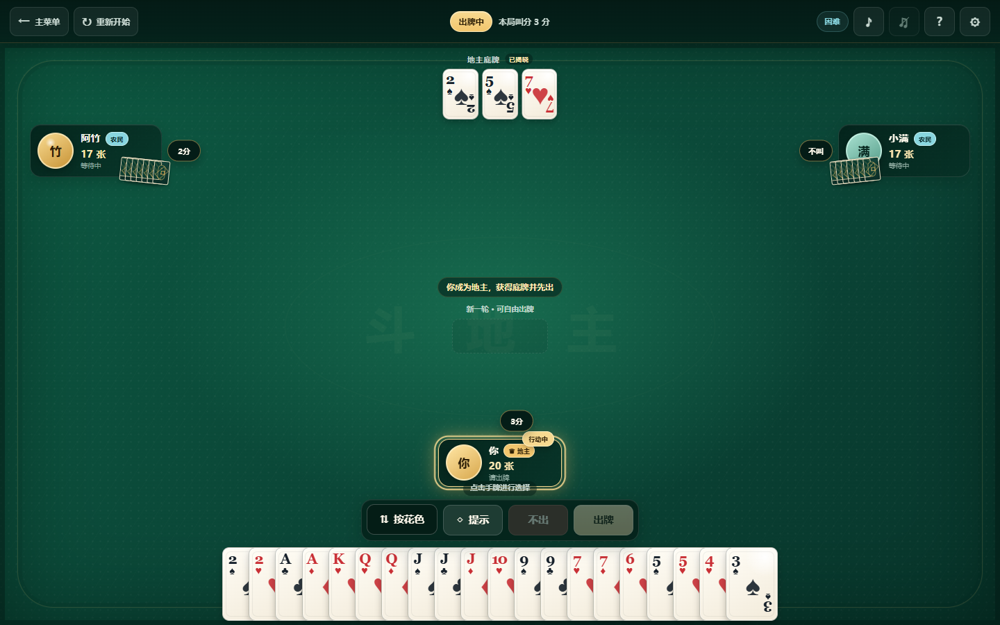

# 经典斗地主 · 单机版

一个完整、离线、零运行时依赖的三人经典斗地主小游戏：你与两名电脑玩家使用标准 54 张扑克牌完成叫地主和出牌对局。没有账号、联网匹配、充值、真钱积分、广告或跟踪代码。



截图文件位于 `docs/game-screenshot.png`；游戏运行不依赖该截图或任何外部图片。

## 当前状态

项目已经可以完整运行。已完成自动化规则/流程/AI 测试和 Microsoft Edge 真实浏览器完整对局验收；游戏可直接从本地文件打开，不需要安装依赖或启动服务器。

## 功能

- 1 名真人玩家 + 2 名启发式 AI 玩家。
- 标准 54 张牌、每人 17 张、3 张底牌，地主拿底牌后 20 张。
- 完整叫分：不叫、1 分、2 分、3 分；3 分立即定地主；全不叫自动重发。
- 地主先出、同型同长度跟牌、炸弹/王炸、两家连续不出后重置出牌权。
- 点击选牌/取消、提示、不出、按牌力或花色理牌。
- 简单、普通、困难三档 AI；共同使用同一套合法动作生成器。
- 主菜单、规则、设置、重开、返回菜单、胜负结算。
- CSS 发牌/选牌/出牌/炸弹/结果动画，并尊重 `prefers-reduced-motion`。
- Web Audio API 程序合成点击、出牌、不出、炸弹和胜负音效；音效与背景音乐可独立关闭。
- 适配常见桌面、移动横屏和窄竖屏；支持键盘焦点、方向键浏览手牌和 `aria-live` 状态提示。
- 所有关键素材本地生成，无远程脚本、字体、图片或音频请求。

## 最简单的启动方法

1. 打开项目文件夹。
2. 双击根目录的 `index.html`。
3. 在主菜单选择难度，点击“开始新对局”。

游戏使用经典脚本而非 ES Modules，因此 `file://` 本地打开即可运行。若浏览器或安全软件禁止本地脚本，可使用任意静态服务器打开此目录，但正常情况下不需要。

## 游戏操作

- 叫地主时，只能选择高于当前最高分的分数，或选择“不叫”。
- 轮到你出牌时，点击手牌使其抬起；再次点击可取消。
- “提示”会选择一组合法牌；若没有可压的牌，会提示选择“不出”。
- “出牌”会验证牌型和大小；非法操作不会改变手牌或轮次，并显示中文原因。
- 新一轮拥有出牌权时不能“不出”。
- “按花色/按牌力”只改变显示顺序，不改变游戏状态。
- 对局中可重新开始或返回主菜单；这两项会先确认，避免误操作。

## 已实现牌型

1. 单张
2. 对子
3. 三张
4. 三带一
5. 三带二
6. 顺子
7. 连对
8. 飞机
9. 飞机带单牌
10. 飞机带对子
11. 四带二单
12. 四带二对
13. 炸弹
14. 王炸

本项目采用严格飞机单翼口径：翅膀点数必须互不相同且不能使用主体点数；对子不能拆成两张单翼。四带二单允许附件恰好是一对。完整说明见 [游戏规则](docs/game-rules.md)。

## AI 策略

AI 不随机拼牌，也没有引入机器学习模型。其流程为：

```text
手牌与桌面状态 → 枚举合法候选 → 过滤能压过的牌 → 评分 → 选择动作
```

评分会考虑剩余牌数、牌型完整性、是否拆炸弹/王炸、最小代价跟牌、一次出完、地主威胁和农民队友协作。三档难度共用规则引擎：简单档使用基础合法策略，普通档加强结构保护和角色关系，困难档进一步提高残局威胁与队友配合权重。

叫地主同样依据手牌质量：王、2、A、炸弹、三张和连续结构会影响评分，不是纯随机决定。

## 自动化测试

玩游戏不需要 Node.js。只有运行开发测试时才需要 Node.js 18 或更高版本。

```bash
npm test
```

也可不经过 npm，直接运行：

```bash
node --test tests/rules.test.js tests/comparator.test.js tests/ai.test.js tests/game-flow.test.js
```

当前测试共 57 项，覆盖：

- 14 种牌型的正确、错误、边界和排列不敏感用例；
- 同型比较、不同长度、炸弹和王炸；
- 发牌唯一性、叫分、全不叫重发、地主底牌、两次不出重置；
- 非当前玩家、重复牌、手牌外牌、非法牌型和压不过时状态完全不变；
- AI 候选合法性、最小合法跟牌、炸弹保护、队友让牌和三档完整自动对局。

真实浏览器验收还完成了 1440×900 桌面完整对局，以及 844×390、667×375、390×844 三种响应式视口检查；控制台错误、页面异常和外部网络请求均为 0。

## 技术与目录

使用 HTML5、CSS3、原生 JavaScript、Web Audio API 和 Node 内置测试运行器，没有生产依赖和构建步骤。

```text
.
├─ index.html                 主菜单、牌桌与弹窗语义结构
├─ src/
│  ├─ game/                  扑克牌、牌型、比较、状态机与控制器
│  ├─ ai/                    合法候选生成与三档启发式策略
│  ├─ ui/                    渲染、交互、动画和程序音频
│  └─ styles/                基础、卡牌和牌桌响应式样式
├─ tests/                    规则、比较、AI 和流程测试
├─ scripts/build-sites.js   Sites 托管适配（不影响直接打开）
├─ docs/
│  ├─ game-rules.md          本项目实际规则口径
│  ├─ github-research.md     GitHub 候选、许可证与设计调研
│  └─ game-screenshot.png    README 截图
├─ output/playwright/        浏览器验收脚本与截图
├─ AGENTS.md                 协作与工程约定
├─ LICENSE                   本项目 MIT 许可证
└─ package.json              零依赖测试与托管构建脚本
```

## GitHub 案例调研

正式实现前筛选了 7 个斗地主项目，重点参考：

- [datamllab/rlcard](https://github.com/datamllab/rlcard)（MIT）：借鉴规则职责拆分、合法动作枚举和测试矩阵。
- [kwai/DouZero](https://github.com/kwai/DouZero)（Apache-2.0）：借鉴“合法候选 → 动作评分”AI 管线和角色差异。
- [svzdev/doudizhu](https://github.com/svzdev/doudizhu)（无独立 LICENSE）：只借鉴经典牌桌节奏和交互思路，不复制代码或资产。

另核验了 `voocel/ddz-vue`、`dixonzhang/cocos-doudizhu`、`linzhipeng/doudizhu`、`ZhouWeikuan/DouDiZhu`。详细技术栈、维护时间、规则/AI/UI 对照、许可证风险与不采用内容见 [GitHub 调研报告](docs/github-research.md)。

本项目代码、CSS 牌面和 Web Audio 音效均独立实现，没有复制上述仓库的源码、美术、Logo、音乐或语音。

## 已知限制

- AI 是可解释的启发式玩家，能完成正常对局，但不等同于竞技级 DouZero 模型。
- 本版本只实现需求指定的单局胜负，不含加倍、春天、残局、计分历史、在线匹配或账号系统。
- 飞机翅膀在不同地区/平台存在变体；本项目采用文档所述严格口径。
- 音频必须在首次用户交互后才能启动；这是现代浏览器的自动播放限制，关闭音频不影响游戏。
- 浏览器完整自动化验收在 Microsoft Edge/Chromium 完成；其他现代桌面浏览器基于标准 Web API 设计，但未在本次环境逐一做完整自动对局。

## 许可证

本项目以 [MIT License](LICENSE) 发布。调研仓库各自许可证只用于确认借鉴边界，不会改变本项目的原创实现与授权。
